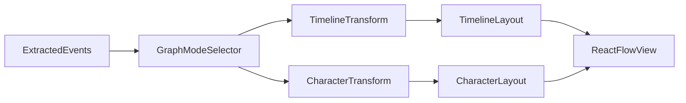

# Dual Graph Modes Implementation Plan

## Scope

Implement dual graph visualization modes in [page.tsx](/Users/roopamgarg/Development/narrative-checker/web-app/src/app/page.tsx):

- `timeline` mode ordered by `timeHint` when recognized, otherwise stable extraction-order fallback.
- `character` mode with both edge styles:
  - co-occurrence
  - action-labeled (`ActionType`-based)

No API contract changes; reuse existing `events[]` from extraction.

## Design Decisions

- Timeline ordering policy: **timeHint-first fallback to sequence**.
- Character relations support **both** styles with a UI selector.
- Boundary nodes/edges remain **timeline-only**.
- Co-occurrence edges are deduplicated by normalized entity pair and accumulate `count` (for diagnostics/labels).
- Action-labeled edges are generated for each `(actor,target)` pair and labeled directly from `event.action` (no free-text NLP inference).
- Large-graph safeguards apply to character mode using edge-density thresholds (warn/block) and are computed in transform output (not UI heuristics).
- Transform logic is split into focused modules to avoid single-file growth and reduce maintenance risk.
- Backward compatibility is preserved by keeping `transformEventsToGraph(events, options)` as a stable facade that defaults to timeline behavior when mode is not provided.
- Character identity in v1 uses strict normalization only (`trim -> collapse whitespace -> lowercase`) and does **not** perform semantic alias merging; this limitation is surfaced in docs to avoid misleading expectations.
- Character graph thresholds are sourced from `src/lib/constants.ts` as explicit app limits (not env-driven for v1) to keep deterministic behavior and testability.

## Transform Result Contract (Upfront)

Define and lock the mode-aware result shape before implementation:

- `nodes`
- `edges`
- `meta?` (optional additive field for backward compatibility in existing callers)
  - `meta.mode`
  - `meta.characterEdgeStyle` (when applicable)
  - `meta.relationEdgeCount`
  - `meta.fallbackOrderCount`
  - `meta.densityStatus` (`ok | warn | blocked`)
  - `meta.thresholds` (active warn/block values used to classify density)
  - `meta.droppedEventCount` (events excluded from character graph due to missing entity pairs)

UI consumes this metadata directly for diagnostics/warnings, avoiding duplicated classification logic.

Also lock graph data unions before implementation:

- Extend `GraphEdgeKind` with `cooccurrence` and `action_labeled`.
- Extend `GraphEdgeData` as a discriminated union:
  - `cooccurrence`: includes `count`.
  - `action_labeled`: includes `action` and direction semantics.
- Keep timeline edge variants unchanged for backward compatibility.

## TimeHint Parsing Policy (Explicit)

- Recognized patterns in v1 timeline sorting:
  - ISO date: `^\d{4}-\d{2}-\d{2}$` (interpreted as UTC midnight).
  - ISO datetime: `^\d{4}-\d{2}-\d{2}T\d{2}:\d{2}(:\d{2})?(?:\.\d+)?(?:Z|[+-]\d{2}:\d{2})$`.
  - Absolute ordinal markers only (examples: `first`, `second`, `third`, `fourth`).
- Deferred in v1 (treated as fallback, not parsed): relative or ambiguous markers such as `then`, `later`, `finally`.
- Unrecognized or ambiguous `timeHint` values are **not inferred**.
- Sorting contract:
  - parsed values become `sortKey` tuples:
    - parsed ISO date/datetime: `[0, epochMs]`
    - parsed ordinal: `[1, ordinalIndex]` where `first=1`, `second=2`, `third=3`, `fourth=4`
    - fallback: `[2, originalIndex]`
  - global sort uses lexicographic tuple compare; tie-breaker is `originalIndex`.
- UI transparency contract:
  - each event carries `timeOrderingSource` metadata: `parsed_timeHint` or `sequence_fallback`.

## File-Level Plan (Sequenced)

1. Define contracts and split transform modules first:
  - Keep [graph-transform.ts](/Users/roopamgarg/Development/narrative-checker/web-app/src/lib/graph-transform.ts) as dispatcher + shared exports.
  - Create focused timeline and character transform modules (plus shared ID/time helper module) under `src/lib/graph-transform/`.
  - Add explicit types:
    - `GraphViewMode = "timeline" | "character"`
    - `CharacterEdgeStyle = "cooccurrence" | "action_labeled"`
    - `timeOrderingSource = "parsed_timeHint" | "sequence_fallback"`
  - Lock mode-aware transform return metadata (`meta.`*) used by UI diagnostics and safeguard messaging.
2. Implement timeline transform with parser + fallback semantics:
  - Parse only recognized `timeHint` patterns (policy above).
  - Keep deterministic ordering via `(parsedSortKey, originalIndex)`.
  - Keep boundary nodes/edges and optional sequence edges in timeline only.
3. Implement character transform with strict edge semantics:
  - Entity nodes: normalized-deduped identities.
  - v1 identity behavior: no alias resolution beyond normalization; document this constraint.
  - Co-occurrence style:
    - one deterministic edge per unordered entity pair
    - pair key uses locale-independent lexical ordering: `pairKey = [entityA, entityB].sort((a,b)=>a<b?-1:a>b?1:0).join(\"|\")`
    - edge ID format: `cooccurrence:${pairKey}`
    - accumulate `count` for repeated co-occurrence across events
  - Action-labeled style:
    - directed edge per `(actor,target)` pair
    - label/value from `event.action` enum
    - deterministic edge ID includes `action + source + target`
  - Exclude boundary nodes/edges in character mode.
  - Events yielding no usable entity relations increment `meta.droppedEventCount` for diagnostics transparency.
  - Compute relation-density classification in transform output:
    - `densityStatus` based on relation edge count against configured warn/block thresholds.
    - include threshold values in result metadata for transparent diagnostics.
4. Add mode-aware layout dispatch in [graph-layout.ts](/Users/roopamgarg/Development/narrative-checker/web-app/src/lib/graph-layout.ts):
  - Timeline: existing LR dagre profile.
  - Character: dagre TB profile in v1 (`rankdir: \"TB\"`, tighter `nodesep`/`ranksep`) to improve readability for relation-heavy graphs while keeping algorithm consistency and low implementation risk.
  - Explicit v2 option (deferred): force-directed layout if TB dagre readability is insufficient in user testing.
  - Add layout tests before UI wiring to validate deterministic behavior.
5. Integrate UI mode controls and diagnostics in [page.tsx](/Users/roopamgarg/Development/narrative-checker/web-app/src/app/page.tsx):
  - Extract `GraphControls` subcomponent for mode/style/sequence controls to keep page orchestration focused.
  - Extract `GraphDiagnostics` subcomponent for mode/style/count/status display.
  - Add Graph Mode selector.
  - Show Character Edge Style selector only in character mode.
  - Show Sequence toggle only in timeline mode.
  - Recompute graph client-side from `events + mode + style + includeSequenceEdges` with no refetch.
  - Add diagnostics fields from `meta` when present: mode, style, relation edge count, fallback-order count, dropped-event count, density status.
6. Apply reliability safeguards for dense character graphs:
  - Extend [constants.ts](/Users/roopamgarg/Development/narrative-checker/web-app/src/lib/constants.ts) with character edge warn/block thresholds.
  - UI reads `meta.densityStatus` and `meta.thresholds` from transform result.
  - Surface warnings when status is `warn`.
  - Block render with clear message when status is `blocked` (same pattern as event-volume guard).
7. Test and documentation completion:
  - Expand [graph-transform.test.ts](/Users/roopamgarg/Development/narrative-checker/web-app/src/lib/graph-transform.test.ts) for all mode semantics.
  - Add `graph-layout.test.ts` dispatch/positioning checks.
  - Add `page.test.tsx` mode-control visibility and recompute-flow checks.
  - Add threshold boundary tests (`warn-1`, `warn`, `block-1`, `block`) for character density status.
  - Update [Architecture.md](/Users/roopamgarg/Development/narrative-checker/web-app/Architecture.md) and [README.md](/Users/roopamgarg/Development/narrative-checker/web-app/README.md).

## Data Flow (Dual Modes)

## Acceptance Criteria

- User can switch between Timeline and Character modes without triggering a new extract request.
- Timeline order uses recognized `timeHint` values first and deterministic fallback otherwise.
- Timeline node metadata exposes `timeOrderingSource` and unresolved hints are marked as `sequence_fallback`.
- Character mode supports both co-occurrence and action-labeled styles from one extracted `events[]` set.
- Co-occurrence edges are deduplicated by unordered entity pair with deterministic IDs and aggregated `count`.
- Action-labeled edges are deterministic, directed, generated per `(actor,target)` pair, and use `event.action` labels.
- Boundary nodes/edges appear only in timeline mode and never in character mode.
- Character mode includes edge-density warn/block safeguards and clear UI messages at threshold.
- Edge/data unions are explicitly typed for new character edge kinds (`cooccurrence`, `action_labeled`).
- Character identity behavior is explicitly documented as normalization-only in v1 (no alias merging).
- Character transform exposes `droppedEventCount` and UI diagnostics display it.
- UI control/diagnostics rendering is extracted into focused components to avoid `page.tsx` growth.
- Existing extraction/proxy behavior remains unchanged.
- Added tests pass for transform, layout, and UI controls.
- Architecture and README reflect new mode semantics and constraints.

