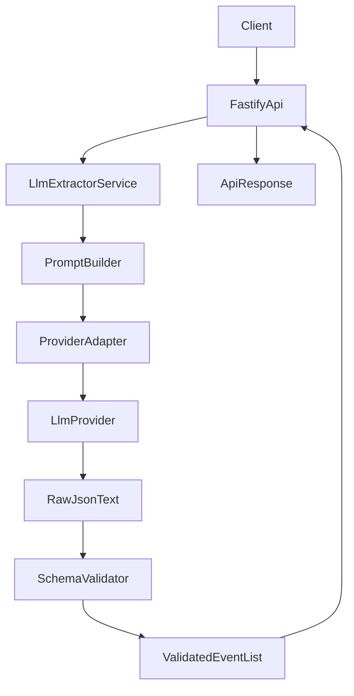

# LLM Layer Monorepo Plan

## Goal

Build a production-ready monorepo focused on story event extraction via LLMs, with strict schema validation and a stable API contract.

## Target Architecture

- **Monorepo layout (pnpm workspaces + Turbo):**
  - `[/Users/roopamgarg/Development/narrative-checker/package.json](/Users/roopamgarg/Development/narrative-checker/package.json)`
  - `[/Users/roopamgarg/Development/narrative-checker/pnpm-workspace.yaml](/Users/roopamgarg/Development/narrative-checker/pnpm-workspace.yaml)`
  - `[/Users/roopamgarg/Development/narrative-checker/turbo.json](/Users/roopamgarg/Development/narrative-checker/turbo.json)`
  - `[/Users/roopamgarg/Development/narrative-checker/packages/contracts](/Users/roopamgarg/Development/narrative-checker/packages/contracts)` (shared schemas/types)
  - `[/Users/roopamgarg/Development/narrative-checker/packages/llm-extractor](/Users/roopamgarg/Development/narrative-checker/packages/llm-extractor)` (prompting + provider adapters + parse/validate)
  - `[/Users/roopamgarg/Development/narrative-checker/apps/api](/Users/roopamgarg/Development/narrative-checker/apps/api)` (Fastify HTTP surface)
- **Responsibility split:**
  - `contracts`: Zod schemas + exported TypeScript types for request/response/event model.
  - `llm-extractor`: provider-agnostic `extractEvents(story, options)` orchestration.
  - `api`: endpoint, request validation, response mapping, error handling.

## API Contract

- **Endpoint:** `POST /v1/events/extract`
- **Request body:** `{ story: string, metadata?: { storyId?: string } }`
- **Postman artifact:** Maintain a canonical Postman collection under `apps/api/postman/` that matches this contract.
- **Success response:**
  - `{ events: Event[], model: string, usage?: { promptTokens: number, completionTokens: number, totalTokens: number }, warnings?: string[], requestId: string }`
- **Event schema (strict):**
  - `eventId: string` (server-generated UUIDv4, not produced by the LLM)
  - `action: ActionType` (must be allowed enum)
  - `actors: string[]`
  - `targets?: string[]`
  - `location?: string`
  - `timeHint?: string`
  - `sourceText: string` (non-empty span/sentence from input story)
  - `confidence: number` (`0 <= confidence <= 1`)
- **Allowed `ActionType` enum (v1):**
  - `MOVE`
  - `SPEAK`
  - `ATTACK`
  - `DEFEND`
  - `DISCOVER`
  - `INTERACT`
  - `EMOTIONAL_CHANGE`
  - `STATE_CHANGE`
  - `ALLIANCE_CHANGE`
  - `ITEM_CHANGE`

## Error Response Contract

- All error responses follow:
  - `{ error: { code: string, message: string, details?: unknown }, requestId: string }`
- Error codes:
  - `INVALID_REQUEST`
  - `EXTRACTION_FAILED`
  - `PROVIDER_ERROR`
  - `RATE_LIMITED`
  - `INTERNAL_ERROR`
- Every response (success and error) includes `requestId` for traceability.

## Prompt and Validation Strategy

- Build a prompt template in `llm-extractor` that:
  - Explicitly defines every event JSON key and expected types.
  - Includes allowed `action` enum values and disallows unknown actions.
  - Requires one event per meaningful narrative action.
  - Requires `sourceText` to quote the exact supporting text.
  - Requires `confidence` as decimal probability in `[0,1]`.
- Implement robust output handling:
  - Parse JSON from model output (strip markdown wrappers safely).
  - Validate with strict Zod schema for structure, required fields, and types.
  - Validate semantic constraints (`action` enum, confidence range, non-empty source).
  - Post-validation: verify each `sourceText` is a substring of input `story` (whitespace-normalized, case-insensitive).
  - On LLM-output validation failure, retry up to `LLM_MAX_RETRIES` and return `EXTRACTION_FAILED` if all attempts fail.
  - Generate `eventId` server-side only after model output passes validation.
  - Return typed domain errors for invalid model output vs provider/network errors.

## Provider-Agnostic LLM Adapter

- Define a shared adapter interface in `llm-extractor`:
  - `generateJson(prompt, config): Promise<{ text, model, usage }>`
- Set **Gemini as the default provider** for the first implementation, while keeping interface-based injection for future providers.
- Add a provider selection strategy:
  - Default to Gemini when no provider is configured.
  - Allow override through environment/config for future providers.
- Centralize retry, timeout, and idempotent request options.
- Set timeout budgets:
  - LLM call timeout default `30000ms`
  - Total extraction budget (including retries) default `90000ms`

## Configuration

- Validate all environment configuration at startup (fail-fast):
  - `LLM_PROVIDER=gemini` (default)
  - `GEMINI_API_KEY` (required for default provider)
  - `LLM_TIMEOUT_MS=30000` (default)
  - `LLM_MAX_RETRIES=2` (default)
  - `MAX_STORY_CHARS=50000` (default)
  - `API_PORT=3000` (default)
  - `API_KEY` (required in non-local environments)
  - `LOG_LEVEL=info` (default)

## Security and Rate Limiting

- Enforce API-key auth using `x-api-key` in Fastify `onRequest`.
- Add input protections:
  - Request body limit default `512KB`
  - Reject `story` longer than `MAX_STORY_CHARS` with `413`
- Apply rate limiting per key/IP (default `60 req/min`).

## Observability

- Use structured JSON logging with `pino`.
- Include `requestId` in all logs and responses.
- Add health endpoints:
  - `GET /healthz` for liveness
  - `GET /readyz` for readiness/dependency checks
- Track core metrics:
  - Request count and latency percentiles
  - Token usage
  - Validation-failure rate
  - Provider-error rate

## Testing and Quality Gates

- Add package-level unit tests for:
  - prompt key completeness,
  - JSON parsing edge cases,
  - schema validation failures,
  - action enum enforcement,
  - confidence/sourceText constraints.
- Add API integration tests for happy path + malformed/partial LLM outputs.
- Add tests for operational guards:
  - auth rejection
  - rate limiting
  - request size and story-length limits
  - retry path for invalid-then-valid LLM outputs
- Add prompt snapshot tests to catch unintentional prompt regressions.
- Add API contract smoke checks through Newman using the Postman collection.
- Add a CI drift check to detect mismatch between Fastify route table and Postman collection routes.
- Add lint/typecheck/test scripts at root and per workspace package.

## Rollout Notes

- Keep extraction response deterministic at schema level even if model wording varies.
- Log invalid model outputs with redaction-safe payload snippets for debugging.
- Version the endpoint contract (`v1`) so action taxonomy changes can be introduced safely later.
- Store prompt templates as reviewable artifacts in `packages/llm-extractor/prompts/`.
- Store Postman collection artifacts as reviewable files in `apps/api/postman/`.
- Target runtime: Node.js 20 LTS+ with TypeScript strict mode enabled.

