# Next.js Graph MVP Plan

## Scope

Build a standalone app at `[/Users/roopamgarg/Development/narrative-checker/web-app](/Users/roopamgarg/Development/narrative-checker/web-app)` for testing event-graph generation and visualization. Do not edit anything inside `[/Users/roopamgarg/Development/narrative-checker/llm-layer](/Users/roopamgarg/Development/narrative-checker/llm-layer)`; consume the existing backend API (`POST /v1/events/extract`) as an external dependency only.

## Implementation Plan

- Scaffold standalone Next.js App Router + TypeScript project in `web-app` with React Flow + dagre.
- Add server-side proxy route (`web-app/src/app/api/extract/route.ts`) that forwards requests to `llm-layer` API and keeps credentials server-side.
- Define local request/response schemas in `web-app` aligned to current API envelope; validate inbound story payload before proxying and validate upstream response before UI use.
- Configure environment-driven integration in `web-app`:
  - `LLM_LAYER_BASE_URL`
  - `LLM_LAYER_API_KEY` (server-only)
  - `REQUEST_TIMEOUT_MS` defaults aligned with backend behavior.
  - Validate required env vars at startup (module-load or Next config validation) and fail fast on missing/malformed URL values.
- Implement explicit edge semantics in `web-app/src/lib/graph-transform.ts`:
  - Event nodes: one node per `eventId`.
  - Entity nodes: deduped normalized identity for actors/targets using this pipeline in order: `trim -> collapse internal whitespace -> lowercase`; preserve first-seen raw form as display label.
  - Edge types in v1:
    - `actor_to_event` (`actor -> event`)
    - `event_to_target` (`event -> target`)
    - `event_sequence` (`event_n -> event_n+1`, disabled by default toggle in UI)
- Use stable IDs:
  - Event node IDs = backend `eventId`.
  - Entity node IDs = deterministic `entity:<normalizedName>`.
  - Edge IDs = deterministic `${type}:${source}->${target}`.
- Add dagre layout pipeline before React Flow render; always output positioned nodes then call `fitView`.
- Build minimal testing UI:
  - Story input + submit.
  - Loading state with elapsed-time indicator and cancel button.
  - Raw events JSON panel.
  - Graph canvas and diagnostics panel (`requestId`, node/edge counts, error code/message).
- Reliability safeguards:
  - Input checks: non-empty and max length guard.
  - Coordinated timeout chain (accounts for backend retry loop worst-case):
    - Proxy upstream fetch timeout defaults to ~95s (and can be overridden by `REQUEST_TIMEOUT_MS`).
    - Browser AbortController timeout defaults to ~100s.
    - Show elapsed-time progress while waiting.
  - Propagate request cancellation end-to-end: use incoming request `AbortSignal` in upstream proxy fetch so cancel actually terminates upstream work.
  - Handle non-JSON and network-level upstream failures explicitly (connection, DNS, timeout, invalid JSON body) and map them to consistent error envelope + status.
  - No proxy-level retry policy (backend already retries internally).
  - Prevent duplicate concurrent submissions for same input.
  - Global in-flight limit of 2 concurrent proxy requests; additional requests get a clear busy response.
  - Large graph thresholds:
    - Warn when events > 80.
    - Truncate or disable render when events > 150 with clear UI message.
  - Map upstream error codes (`INVALID_REQUEST`, `EXTRACTION_FAILED`, `PROVIDER_ERROR`, `RATE_LIMITED`, `INTERNAL_ERROR`) to user-friendly messages.
- Tests in `web-app`:
  - Transformer unit tests (normalization, dedup, edge derivation, stable IDs).
  - Proxy route tests for timeout and error mapping.
  - Contract drift smoke test against pinned fixture samples matching current API shape.
- Documentation only in `web-app/README.md` (setup, env vars, run steps, known limits). No edits in `llm-layer`.

## Data Flow (MVP)

```mermaid
flowchart LR
  userInput[UserStoryInput] --> webUI[StandaloneNextWebApp]
  webUI --> proxyRoute[ServerProxyRoute]
  proxyRoute --> extractApi[LlmLayerExtractApi]
  extractApi --> eventsData[ExtractedEvents]
  eventsData --> transformLayer[DeterministicGraphTransform]
  transformLayer --> layoutLayer[DagreLayout]
  layoutLayer --> reactFlowView[ReactFlowCanvas]
```

## Key Non-Goals (for now)

- No backend contract changes to return graph schema.
- No code changes under `llm-layer`.
- No advanced coreference/alias resolution beyond basic normalization.
- No production-grade graph UX polish yet (this is testing-focused).

