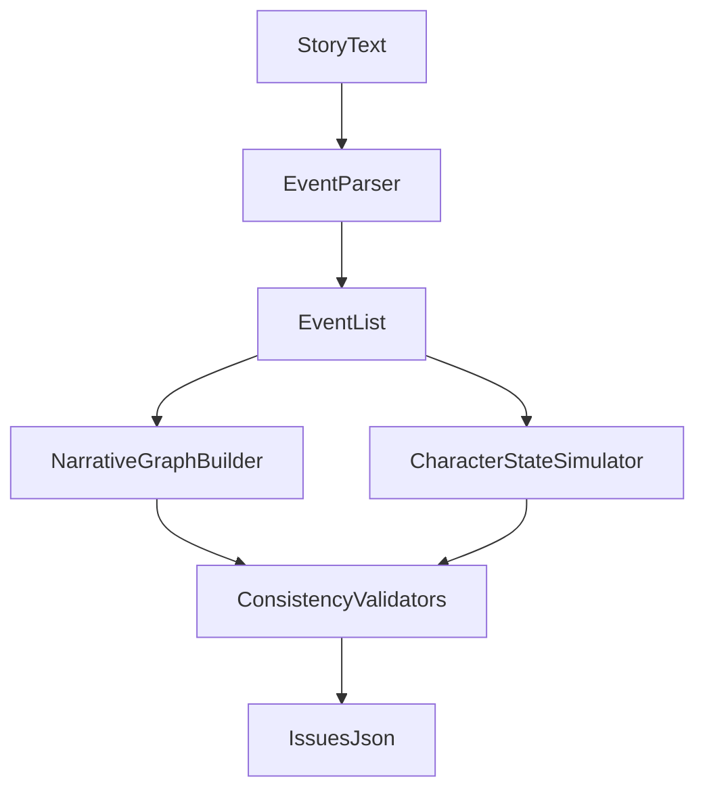

# Narrative Consistency Checker MVP Plan

## Assumptions (because choices were skipped)

- Use **TypeScript (Node.js)**.
- Deliver a **CLI-first** runnable MVP (`stdin` or file input), with architecture ready for a future API wrapper.
- Keep extraction deterministic with regex/keyword heuristics only (no LLMs, no external APIs).

## Architecture

- `parsing` layer: sentence splitting + heuristic extraction of characters/actions/locations.
- `graph` layer: adjacency-list narrative graph in strict event order.
- `state` layer: sequential character simulation (`isAlive`, `currentLocation`).
- `validation` layer: issue detection (`CHARACTER_STATE`, `LOCATION`, `TIMELINE`).
- `orchestration` layer: single pipeline from story text → structured output JSON.

## Planned File Structure

- Core setup
  - `[/Users/roopamgarg/Development/narrative-checker/package.json](/Users/roopamgarg/Development/narrative-checker/package.json)`
  - `[/Users/roopamgarg/Development/narrative-checker/tsconfig.json](/Users/roopamgarg/Development/narrative-checker/tsconfig.json)`
- Source
  - `[/Users/roopamgarg/Development/narrative-checker/src/types.ts](/Users/roopamgarg/Development/narrative-checker/src/types.ts)`
  - `[/Users/roopamgarg/Development/narrative-checker/src/parsing/extractEvents.ts](/Users/roopamgarg/Development/narrative-checker/src/parsing/extractEvents.ts)`
  - `[/Users/roopamgarg/Development/narrative-checker/src/graph/buildNarrativeGraph.ts](/Users/roopamgarg/Development/narrative-checker/src/graph/buildNarrativeGraph.ts)`
  - `[/Users/roopamgarg/Development/narrative-checker/src/state/simulateCharacterState.ts](/Users/roopamgarg/Development/narrative-checker/src/state/simulateCharacterState.ts)`
  - `[/Users/roopamgarg/Development/narrative-checker/src/validation/checkCharacterState.ts](/Users/roopamgarg/Development/narrative-checker/src/validation/checkCharacterState.ts)`
  - `[/Users/roopamgarg/Development/narrative-checker/src/validation/checkLocationConflicts.ts](/Users/roopamgarg/Development/narrative-checker/src/validation/checkLocationConflicts.ts)`
  - `[/Users/roopamgarg/Development/narrative-checker/src/validation/checkTimeline.ts](/Users/roopamgarg/Development/narrative-checker/src/validation/checkTimeline.ts)`
  - `[/Users/roopamgarg/Development/narrative-checker/src/checker/runConsistencyCheck.ts](/Users/roopamgarg/Development/narrative-checker/src/checker/runConsistencyCheck.ts)`
  - `[/Users/roopamgarg/Development/narrative-checker/src/cli.ts](/Users/roopamgarg/Development/narrative-checker/src/cli.ts)`
- Tests and docs
  - `[/Users/roopamgarg/Development/narrative-checker/tests/validation.test.ts](/Users/roopamgarg/Development/narrative-checker/tests/validation.test.ts)`
  - `[/Users/roopamgarg/Development/narrative-checker/examples/sample-story.txt](/Users/roopamgarg/Development/narrative-checker/examples/sample-story.txt)`
  - `[/Users/roopamgarg/Development/narrative-checker/README.md](/Users/roopamgarg/Development/narrative-checker/README.md)`

## Implementation Details

1. Define strict shared types for `Event`, `ActionType`, `CharacterState`, graph adjacency list, and output `Issue` schema.
2. Implement event extraction:
  - Split text into sentences.
  - Map each sentence to one `Event` with stable `id`.
  - Extract character candidates (simple proper-name heuristic + dedup).
  - Detect actions by keywords (`dies`, `goes to`, `travels to`, `meets`) and parse target location if present.
3. Build directed narrative graph as adjacency list where each event points to the next (`i -> i+1`).
4. Simulate character state in event order:
  - Default unseen character state: `{ isAlive: true, currentLocation: undefined }`.
  - Apply action effects deterministically.
5. Run validators:
  - `CHARACTER_STATE`: dead character appears in later events.
  - `LOCATION`: conflicting location assignment without explicit transition.
  - `TIMELINE`: cycle check on adjacency list (currently expected false for linear graph, but implemented for extensibility).
6. Return final JSON `{ issues: Issue[] }` with clear event references and human-readable messages.
7. Add tests for core validator behavior and edge cases (empty story, single sentence, multiple characters, repeated names).
8. Add README with approach, assumptions, limitations, and example I/O.

## Scope Control

- Keep extraction intentionally heuristic and explainable.
- No NLP libraries unless strictly needed for sentence splitting robustness.
- Keep API endpoint as future extension; if time remains, add a tiny wrapper around the same pipeline.

