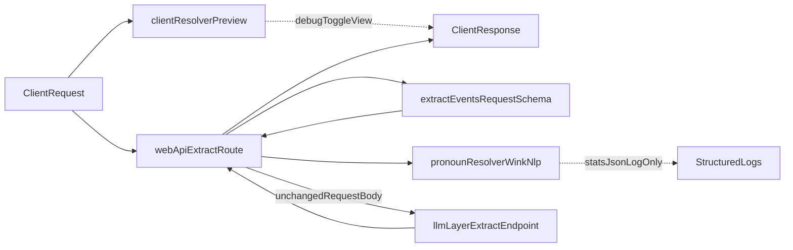

# Wink-NLP Pronoun Resolution Plan

## Goal

Improve future entity consistency by running a deterministic pronoun resolver (non-possessive **he/him, she/her-object, they/them** in Phase 1) alongside extract requests. **Phase 1 does not change the upstream request body or the API response**; it validates the pipeline, latency, and precision under a feature flag with structured logs only, and adds a **client-side resolved preview** in the UI behind a Debug toggle.

## Scope And Decisions

- Integrate in `[/Users/roopamgarg/Development/narrative-checker/web-app/src/app/api/extract/route.ts](/Users/roopamgarg/Development/narrative-checker/web-app/src/app/api/extract/route.ts)`.
- Use `wink-nlp` + `wink-eng-lite-web-model` for POS/NER signals, plus a **custom deterministic resolver** (wink-nlp has no built-in coreference).
- UI requirement selected: show resolved values from **client-side preview** only, hidden behind a **Debug toggle** in `[web-app/src/app/page.tsx](/Users/roopamgarg/Development/narrative-checker/web-app/src/app/page.tsx)`.
- Delivery split: server-side resolver/logging (steps 1-7) lands first; UI preview ships in **Phase 1a follow-up PR** after compatibility-spike results are known.
- Single implementation rule: UI preview and server logging must use the same `resolvePronouns` implementation from `[web-app/src/lib/pronoun-resolver.ts](/Users/roopamgarg/Development/narrative-checker/web-app/src/lib/pronoun-resolver.ts)`; no duplicated resolver logic.
- **Phase 1 (this plan):** After Zod validation, if the flag is on, run the resolver and emit **one structured JSON log line per request** with aggregate counters and timing. **Do not** attach `resolvedStory`, `applied`, or new `metadata` fields to the upstream `fetch` body or to the JSON returned to the client. Forwarded body remains `JSON.stringify(requestParseResult.data)` (same object as validated input).
- **Phase 1b (optional follow-up, not in initial PR):** Forward optional resolver fields in `metadata` only after parity is verified with the llm-layer request schema (`[llm-layer/packages/contracts](llm-layer/packages/contracts)`, strict Zod on upstream). Until then, no dual-mode forward.
- **Phase 2:** Upstream may consume `resolvedStory` or substituted `story`; gated by quality and latency criteria below.
- Add strict input guards so preprocessing never jeopardizes route latency beyond stated budgets.

## Explicit Resolver Contract

### Output type (canonical for implementers)

```ts
type ResolverResult = {
  resolvedStory: string;
  stats: {
    pronounsFound: number;
    pronounsResolved: number;
    pronounsSkipped: number;
  };
  applied: Array<{
    pronoun: string;
    position: { sentenceIndex: number; tokenIndex: number };
    replacement: string;
    confidence: "high";
  }>;
  skipReason?:
    | "input_too_long"
    | "model_failure";
};
```

- **Input:** raw `story` string after `extractEventsRequestSchema` validation.
- Route-level skip reasons (flag off, request-level policy skips) are not part of `ResolverResult`; they are emitted by route logging.
- **Confidence policy (deterministic):**
  - `high`: in the pronoun’s lookback window, `distinctPersonCount === 1` (see algorithm) and agreement checks pass; then append to `applied` and rewrite that pronoun token to that person’s canonical surface string.
  - `low`: `distinctPersonCount === 0` or `>= 2`, agreement failure, or token not tracked; pronoun unchanged, increments `pronounsSkipped` (still counts toward `pronounsFound` for tracked pronouns).
- **Agreement checks (Phase 1):** entity type `PERSON` plus lightweight pronoun-class gate:
  - `he/him` require local antecedent gender hint = `masc`,
  - `she/her` (object form) require hint = `fem`,
  - `they/them` allow hint in `{neutral, unknown}` (singular-they permissive, intentionally allowing resolution when no prior hint is established).
  - **Single-candidate `unknown` carve-out:** if hint is `unknown` for `he/him/she/her` **and** `distinctPersonCount === 1` in the lookback window, allow resolution. Crowding alone provides sufficient precision; the resolved pronoun does not retroactively set the entity's hint.
  - **Conflict skip:** if hint conflicts with pronoun class (e.g. `she` with `masc` hint), always skip — never override.
- **Hard fallbacks:** on oversize input, model/parse throw, or flag off — return `resolvedStory === story`, empty `applied`, and set `skipReason` when applicable.

## Deterministic Resolution Algorithm (Phase 1)

- Sentence-level pass with wink-nlp tokenization, POS, and NER.
- **Tracked pronouns (Phase 1, non-possessive only):** `he`, `him`, `she`, `they`, `them`, plus `**her` only when POS is object pronoun (`PRP`), not possessive (`PRP$`)** — so “Aria tightened **her** grip” is skipped in Phase 1, while “Aria saw **her**” can resolve when crowding allows. **Excluded in Phase 1 (deferred to Phase 2 with possessive-aware rewriting):** `his`, `hers`, `their`, `theirs`, possessive `her` (`PRP$`), and any other possessive/determiner-like forms. Same crowding rules apply to all tracked tokens.
- **Lookback window (deterministic):** For a pronoun at `(sentenceIndex_p, tokenIndex_p)`, collect all `PERSON` spans whose start token `(sentenceIndex_c, tokenIndex_c)` satisfies: `sentenceIndex_c >= sentenceIndex_p - 3` **and** `(sentenceIndex_c < sentenceIndex_p OR (sentenceIndex_c === sentenceIndex_p AND tokenIndex_c < tokenIndex_p))`. That is: up to **three** full sentences before the pronoun’s sentence, plus tokens in the pronoun’s sentence **strictly before** the pronoun.
- **Crowding gate:** Let `distinctPersonCount` = number of **distinct** `PERSON` surface strings in that window (normalize with **Unicode case-folding** only; no stemming). If `distinctPersonCount !== 1`, the pronoun is `**low`** (covers “Frodo and Sam … They”, and “Frodo saw Aragorn … He”).
- **Single-antecedent substitution:** If `distinctPersonCount === 1`, let `name` be that string. Apply pronoun-class agreement checks above; only then mark `high` and replace token with canonical `name`.
- **Canonical spelling:** Use the **most recent** mention’s surface form for `name` among `PERSON` spans equal to `name` under case-folding, where “most recent” means maximum `(sentenceIndex, tokenIndex)` in the window. **No subject/object tiebreaker** (no dependency parse in Phase 1).
- **Asymmetric scope by design:** hint-building uses same-sentence single-entity attribution (high-confidence only), while resolution uses 3-sentence lookback crowding. This prevents weak cross-sentence evidence from poisoning global hints.
- Ambiguity: any `low` path leaves the pronoun unchanged and increments skipped.
- Exclusions: `it/its`, demonstratives, non-person references.
- **Unicode / non-English names:** No extra Unicode logic beyond wink. If NER does not tag a name as `PERSON`, that span is not a candidate (safe: fewer resolutions, not wrong links).
- **Gender hint source (deterministic, no external data):**
  - **First pass (global evidence):** scan the full story once to build `Map<normalizedName, genderHint>` from pronoun co-occurrence evidence; this pass only gathers hints and does not resolve tokens.
  - **First-pass attribution rule (hint-building only):** for a gendered pronoun at position `P`, collect `PERSON` entities in the same sentence as `P` with start token strictly before `P`. If exactly one such entity exists, attribute pronoun evidence to that entity; if zero or multiple exist, ignore that pronoun for hint-building.
  - **Second pass (window-scoped resolution):** for each tracked pronoun, apply the lookback crowding gate; if one antecedent remains, consult the global hint map for agreement.
  - Build per-entity hints from in-story mentions (global pass):
    - seeing `<Name> ... he/him/his` sets `masc`,
    - seeing `<Name> ... she/her/hers` (object or possessive evidence) sets `fem`,
    - seeing `<Name> ... they/them/their` sets `neutral`.
  - Hint evidence may include possessive forms for classification only; replacement eligibility still follows the tracked-pronoun list (possessives remain non-replaceable in Phase 1).
  - Conflicting hints downgrade to `unknown`. Resolution then follows the same rules as any other `unknown` hint — including the single-candidate carve-out for `he/him/she/her`. (Rationale: keep the hint type a simple union of `masc | fem | neutral | unknown`; precision is preserved by the crowding gate when only one PERSON is present in the window.)

## Implementation Steps

1. **Compatibility spike gate**
  - Create a minimal client-only import path for `wink-nlp@2.4.0` + `wink-eng-lite-web-model@1.8.1`, run `next build`, and confirm browser bundle compiles/runs without Node polyfills.
  - Pass criteria: `next build` succeeds and lazy preview chunk size is measured.
  - Pass criteria (semantic parity): run a fixed fixture set in both Node and browser environments and verify `ResolverResult` byte-for-byte equality.
  - Fail criteria: build/runtime incompatibility or unacceptable bundle profile; if fail, switch UI preview to server-backed debug preview and continue server-side Phase 1 unchanged.
2. **Resolver module**
  - Add `[web-app/src/lib/pronoun-resolver.ts](/Users/roopamgarg/Development/narrative-checker/web-app/src/lib/pronoun-resolver.ts)`: export `resolvePronouns(story: string): ResolverResult`, lazy singleton model init, pure logic aside from model read.
  - Implement resolver as explicit two-pass flow: global hint collection pass, then per-pronoun resolution pass with lookback crowding + agreement checks.
  - Export `ResolverResult` from this module and consume it via `import type` in client/server call sites.
  - Dependencies (pin exact versions in `package.json`; lockfile is source of truth): `**wink-nlp@2.4.0`**, `**wink-eng-lite-web-model@1.8.1`**.
  - Lazy singleton failure policy: if model initialization throws, do **not** cache failure state; allow next invocation to retry model loading. Caller-side fallback handles temporary failures safely.
  - Concurrency safety for cold start: guard model initialization with a shared promise so simultaneous first requests await one load attempt.

```ts
    let initPromise: Promise<ModelInstance> | null = null;
    function getModel(): Promise<ModelInstance> {
      if (!initPromise) {
        initPromise = loadModel().catch((error) => {
          initPromise = null;
          throw error;
        });
      }
      return initPromise;
    }
    

```

- If the compatibility spike fails, switch UI preview to server-backed debug preview (`/api/preview`-style endpoint) while preserving Phase 1 immutability guarantees for main extract flow.

1. **Environment and limits**
  - In `[web-app/src/lib/env.ts](/Users/roopamgarg/Development/narrative-checker/web-app/src/lib/env.ts)`:
    - `enablePronounResolution: process.env.ENABLE_PRONOUN_RESOLUTION === "true"`.
    - `pronounResolverMaxChars: number` from `process.env.PRONOUN_RESOLVER_MAX_CHARS` parsed using the same pattern as existing `env.ts` helpers (`Number()` + `Number.isFinite()` + positive guard), default **10000** when unset/invalid.
  - Add shared preview cap constant in `[web-app/src/lib/constants.ts](/Users/roopamgarg/Development/narrative-checker/web-app/src/lib/constants.ts)` (e.g., `pronounPreviewMaxChars: 10000`) and use it for client preview gating.
  - Update `[web-app/.env.example](/Users/roopamgarg/Development/narrative-checker/web-app/.env.example)`: `ENABLE_PRONOUN_RESOLUTION=false`, `PRONOUN_RESOLVER_MAX_CHARS=10000`.
2. **Proxy route integration**
  - Create `requestId = randomUUID()` once per request at the start of `POST()`. Use this same ID for resolver logs, error responses, and success response correlation.
  - Keep existing `makeErrorBody` behavior in Phase 1 to avoid unrelated error-path churn. Phase 1 correlation guarantee applies to resolver logs and success-path observability only; error-response `requestId` remains independently generated until a dedicated refactor phase.
  - In `[web-app/src/app/api/extract/route.ts](/Users/roopamgarg/Development/narrative-checker/web-app/src/app/api/extract/route.ts)`: after successful `safeParse`, if `serverEnv.enablePronounResolution` and `story.length <= serverEnv.pronounResolverMaxChars`, call `resolvePronouns`; else skip with `skipReason` as appropriate.
  - Wrap the `resolvePronouns` call in route-level `try/catch`; on exception, emit structured `pronoun_resolver_error` log with `requestId` and continue to upstream `fetch` with unmodified body. Resolver failures must never block extraction.
  - `**fetch` body:** always `JSON.stringify(requestParseResult.data)` — never merge resolver output into the upstream payload in Phase 1.
  - `**export const runtime = "nodejs"`** on this route module for wink compatibility.
  - Before implementation, verify in `node_modules/next/dist/docs/` that `runtime` export is still the correct Next.js 16 mechanism; if changed, adopt the Next.js 16 equivalent to force Node runtime.
  - **Logging (Phase 1 only consumer of resolver output):** one JSON log line per invocation when flag is on (and optionally when skipped due to length, with `skipReason`), using this shape (no story text, no `resolvedStory`, no `applied` text):
  - Emit logs via `console.log(JSON.stringify({...}))` as single-line JSON (no pretty-print, no external logging dependency in Phase 1).

```json
{
  "event": "pronoun_resolver",
  "requestId": "uuid",
  "pronounsFound": 2,
  "pronounsResolved": 1,
  "pronounsSkipped": 1,
  "skipReason": null,
  "storyLengthChars": 4200,
  "durationMs": 12
}
```

1. **Performance and runtime safety**
  - Resolver is **synchronous** on the Node event loop; char cap is the primary guard (no fake “timeout” around CPU work).
  - **Concurrency:** With `[appLimits.maxConcurrentRequests](web-app/src/lib/constants.ts)` (e.g. 2), two resolver passes may serialize on the event loop; **50ms p99 is per invocation**; worst-case wall-clock stacking is acceptable at current scale. If concurrency rises, revisit worker threads (Phase 2+).
  - Target: resolver adds **<= 50ms p99** for stories **<= 10_000** chars, measured by the benchmark harness before flipping default flag.
  - **Benchmark miss:** keep `ENABLE_PRONOUN_RESOLUTION` default `false`, tighten `PRONOUN_RESOLVER_MAX_CHARS`, document outcome in Architecture; optional worker-thread spike as future work.
  - Benchmark remediation policy: reduce `PRONOUN_RESOLVER_MAX_CHARS` to the highest value that passes p99 target; if no value `>= 2000` chars passes, keep feature disabled in Phase 1 and document outcome in Architecture.
  - **Cold start:** first load of `wink-eng-lite-web-model` in a fresh process costs on the order of tens of ms; document for serverless vs long-lived Node.
  - **Memory footprint check:** measure and document resident memory delta after first model load; deployment envelope is `<= 50MB RSS delta` per process — if exceeded, keep feature disabled by default and document mitigation.
2. **Benchmark harness**
  - Add a repeatable script or vitest performance suite (e.g. under `web-app/scripts/` or `web-app/src/lib/pronoun-resolver.bench.ts`) that runs `resolvePronouns` on **>= 100** inputs: all files under `[llm-layer/examples/stories/](llm-layer/examples/stories/)` plus **5** synthetic stories of **~8000** chars each from a **deterministic generator** (fixed seed).
  - **Synthetic story content spec (stress, not lorem ipsum):** Each of the 5 synthetic stories must be built by repeating a template paragraph that contains **>= 3 distinct `PERSON`-like capitalized names**, **>= 6 Phase-1 tracked pronouns** (only `he`, `him`, `she`, object `her`, `they`, `them` — **no** `his`/`their`/possessive `her`), and **>= 2 sentences** per paragraph, concatenated until length is in `[7500, 8500]` chars. Names and pronoun placements are fixed literals from the generator (same seed → same bytes) so benchmarks are reproducible.
  - Record p99 `durationMs` for `story.length <= pronounResolverMaxChars`. Do not enable the flag by default in `.env.example` until this passes.
  - Add labeled-evaluation subset (minimum 30 stories) with manually annotated resolvable pronoun mentions to compute:
    - `precision = correctReplacements / attemptedReplacements`
    - `recall = correctReplacements / totalResolvableMentionsInGroundTruth`
    - `coverage = attemptedReplacements / totalTrackedPronounMentions`
  - Define annotation schema and storage for evaluation corpus:
    - store under `web-app/test-fixtures/pronoun-eval/`,
    - one JSON per story with fields: `story`, `mentions[]`,
    - each mention contains `{ sentenceIndex, tokenIndex, pronoun, expectedAction: "resolve" | "skip", expectedReplacement?: string }`,
    - include short annotation guideline (when to mark resolvable vs skip) to keep labels consistent across annotators.
  - Evaluation corpus creation strategy:
    - source: mix of `llm-layer/examples/stories/` derivatives and manually authored dialogue-heavy samples,
    - owner: assigned in implementation ticket before Phase 2 promotion review,
    - timeline: corpus must exist before any Phase 2 promotion decision (not required for initial Phase 1 merge).
3. **Testing (concrete I/O — these are the specification)**
  In `web-app/src/lib/pronoun-resolver.test.ts`, assert at least:

  | Case                                                  | Input                                                               | Expected `resolvedStory`                                               | Expected counts / notes                                                                                                                                                                                                                                                                                                                                                                                                                                                       |
  | ----------------------------------------------------- | ------------------------------------------------------------------- | ---------------------------------------------------------------------- | ----------------------------------------------------------------------------------------------------------------------------------------------------------------------------------------------------------------------------------------------------------------------------------------------------------------------------------------------------------------------------------------------------------------------------------------------------------------------------- |
  | no-pronoun pass-through                               | `Aria found a map.`                                                 | identical                                                              | `stats.pronounsFound === 0`, `applied.length === 0`                                                                                                                                                                                                                                                                                                                                                                                                                           |
  | possessive not tracked                                | `Boromir drew his sword.`                                           | identical                                                              | `pronounsFound === 0` (`his` excluded in Phase 1)                                                                                                                                                                                                                                                                                                                                                                                                                             |
  | single antecedent                                     | `Boromir drew his sword. He charged forward.`                       | `Boromir drew his sword. Boromir charged forward.`                     | `pronounsResolved >= 1`, `applied.length >= 1` for subject `He` only; `his` unchanged                                                                                                                                                                                                                                                                                                                                                                                         |
  | ambiguous multi-candidate                             | `Frodo saw Aragorn. He smiled.`                                     | unchanged                                                              | `pronounsSkipped >= 1` for unresolved `He`                                                                                                                                                                                                                                                                                                                                                                                                                                    |
  | possessive her skip                                   | `Aria tightened her grip.`                                          | unchanged                                                              | `her` tagged as possessive (`PRP$`) is excluded                                                                                                                                                                                                                                                                                                                                                                                                                               |
  | they plural ambiguity                                 | `Gandalf spoke to Frodo and Sam. They listened.`                    | unchanged                                                              | plural ambiguity → skip                                                                                                                                                                                                                                                                                                                                                                                                                                                       |
  | they single candidate                                 | `Alex entered the room. They sat down.`                             | `Alex entered the room. Alex sat down.`                                | resolves because `they` allows hint `{neutral, unknown}`; first pass may leave hint `unknown`                                                                                                                                                                                                                                                                                                                                                                                 |
  | him resolves single antecedent                        | `Boromir stood alone. The arrow struck him.`                        | `Boromir stood alone. The arrow struck Boromir.`                       | `pronounsResolved >= 1`                                                                                                                                                                                                                                                                                                                                                                                                                                                       |
  | she resolves single antecedent                        | `Aria entered the hall. She looked around.`                         | `Aria entered the hall. Aria looked around.`                           | hint is `unknown` (no prior gendered evidence in same sentence as `She`); resolves via single-candidate `unknown` carve-out                                                                                                                                                                                                                                                                                                                                                   |
  | object her resolves (PRP)                             | `Aria walked in. The light struck her.`                             | `Aria walked in. The light struck Aria.`                               | `her` tagged `PRP` (object), single PERSON in window; tests PRP-vs-PRP$ disambiguation                                                                                                                                                                                                                                                                                                                                                                                        |
  | them resolves single antecedent                       | `Alex stood apart. The crowd ignored them.`                         | `Alex stood apart. The crowd ignored Alex.`                            | `them` allows `{neutral, unknown}`                                                                                                                                                                                                                                                                                                                                                                                                                                            |
  | he-without-hint resolves (single-candidate carve-out) | `Aria entered. He waited.`                                          | `Aria entered. Aria waited.`                                           | single PERSON in window; `unknown` hint allowed via carve-out (`pronounsResolved >= 1`); competing-PERSON case is covered by the separate "ambiguous multi-candidate" row above                                                                                                                                                                                                                                                                                               |
  | zero-person window                                    | `The wind howled. He ran.`                                          | unchanged                                                              | `distinctPersonCount === 0` in window → skip                                                                                                                                                                                                                                                                                                                                                                                                                                  |
  | she-with-masc-hint conflict skip (he resolves)        | `Borin said he was ready. She moved forward.`                       | `Borin said Borin was ready. She moved forward.`                       | `he` resolves: single PERSON in window, `masc` hint matches (line 83); `She` skipped via conflict skip (line 87): `she` requires `fem` but Borin's hint is `masc`. `pronounsResolved >= 1`, `pronounsSkipped >= 1`                                                                                                                                                                                                                                                            |
  | conflict downgrade -> carve-out resolves              | `Alex said he was ready. Alex then told her to hurry. They waited.` | `Alex said Alex was ready. Alex then told Alex to hurry. Alex waited.` | first-pass attributes `masc` (from `he` in S0) and `fem` (from `her` in S1) to `Alex` -> conflict downgrades global hint to `unknown`. Second pass: `he` in S0 (single PERSON in window, hint `unknown`) resolves via carve-out (line 86); `her` (PRP) in S1 resolves via carve-out; `They` in S2 resolves via the standard `they/them` rule (line 85, allows `{neutral, unknown}`). Exercises the conflict -> unknown -> carve-out path end-to-end. `pronounsResolved >= 3`. |
  | length skip                                           | string length **> `pronounResolverMaxChars`**                       | identical to input                                                     | `skipReason === "input_too_long"`                                                                                                                                                                                                                                                                                                                                                                                                                                             |
  | model failure                                         | mock wink / its to throw                                            | identical to input                                                     | `skipReason === "model_failure"`                                                                                                                                                                                                                                                                                                                                                                                                                                              |
  | POS mis-tag canary (mocked)                           | `Aria tightened her grip.` with POS mocked as object `her` (`PRP`)  | `Aria tightened Aria grip.` (known bad rewrite)                        | regression canary documenting current limitation; do not promote upstream substitution until Phase 2 heuristics                                                                                                                                                                                                                                                                                                                                                               |

   Extend `[web-app/src/app/api/extract/route.test.ts](/Users/roopamgarg/Development/narrative-checker/web-app/src/app/api/extract/route.test.ts)`:
  - **Flag off:** behavior matches current tests; `fetch` body equals `JSON.stringify(validRequest)` (or equivalent validated payload).
  - **Flag on:** spy logger or `console.log`; assert **upstream `fetch` body unchanged** vs flag-off case for the same input; existing error mapping / timeout / success tests still pass.
4. **Documentation**
  - Update `[web-app/Architecture.md](/Users/roopamgarg/Development/narrative-checker/web-app/Architecture.md)`: Phase 1 flow, log schema, env vars, rollback, concurrency note, benchmark gate.
5. **UI resolved-value preview (client-only, debug-toggle)**
  - In `[web-app/src/app/page.tsx](/Users/roopamgarg/Development/narrative-checker/web-app/src/app/page.tsx)`, add local UI state for:
    - `showResolverDebug` (default `false`),
    - `resolvedPreview` (`string | null`),
    - `resolverPreviewStats` (full `ResolverResult.stats` + `skipReason`).
  - Trigger resolver execution only via explicit **Generate Preview** action when Debug panel is open (not on every keystroke).
  - Preview guardrails:
    - only run when story length is `<= appLimits.pronounPreviewMaxChars`,
    - otherwise show `Preview skipped: input too long`.
  - Wrap client preview resolution in `try/catch`; on failure set a non-blocking UI message (`Preview unavailable`) and set `skipReason = "model_failure"` in preview stats.
  - Client preview performance target: model load + first resolve should complete within `<= 2s` on target baseline device; always display loading state while resolving.
  - Add a Debug toggle control in the left panel; when enabled, show:
    - Original story,
    - Resolved preview story,
    - Counters (`pronounsFound`, `pronounsResolved`, `pronounsSkipped`, `skipReason`).
  - Ensure this UI preview is explicitly labeled “Preview only” and never treated as source of truth for API payload in Phase 1.
  - Keep submit payload unchanged: `body: JSON.stringify({ story: normalizedStory })`.
  - Lazy loading is mandatory: dynamically import resolver/model only when debug preview is first requested.
  - Bundle gate is driven by compatibility spike measurement: if lazily loaded preview chunk for wink packages is `> 500KB gzip`, keep preview development-only; if `<= 500KB gzip`, it can be promoted per rollout checks.
  - Delivery policy: ship debug preview as **development-only by default** in the first rollout; promote to production-visible only after measured chunk size and runtime checks pass.
  - Isomorphic constraint: `pronoun-resolver.ts` must remain runtime-portable for Node + browser (no Node-only imports such as `fs/path/crypto`); verify with `next build`.
  - Add parity test fixtures asserting client preview output equals server-side `resolvePronouns` output byte-for-byte.

## Phase 1b (optional; separate PR)

- After confirming `[llm-layer` request schema](/Users/roopamgarg/Development/narrative-checker/llm-layer/packages/contracts) accepts extra optional `metadata` keys without `.strict()` rejection, extend web-app and upstream contracts in lockstep and forward e.g. `resolvedStory` + compact stats. Until that checklist is done, Phase 1 ships **logs only**.

## Phase 2 (upstream behavior change)

- Consume `resolvedStory` or substitute `story` for extraction only after:
  - Manual review on a sampled set shows **>= 90%** precision on replacements recorded in `applied`,
  - No increase in upstream **4xx/5xx** rates,
  - Latency target still met with flag on at expected concurrency.

## Rollback

- Set `ENABLE_PRONOUN_RESOLUTION=false` and redeploy; no migrations or data cleanup.
- Phase 1 does not mutate forwarded payloads, so rollback removes log noise and CPU only.

## Acceptance Criteria

- Existing `/api/extract` tests pass unchanged with flag off (bit-for-bit parity with current proxy).
- All resolver test rows in the table above are implemented and green.
- With flag on: integration test proves `**fetch` body** is byte-identical to the validated request body (no resolver fields leaked upstream).
- Benchmark: **<= 50ms p99** resolver `durationMs` for corpus as defined in step 5 (document actual number in Architecture after first run).
- Evaluation baseline: record `precision`, `recall`, and `coverage` from the labeled subset in Architecture.md before any Phase 2 promotion decision.
- Structured logs never include raw `story`, `resolvedStory`, or `applied` text.
- UI: Debug toggle is off by default; when on, resolved preview and stats render correctly without altering request body or response parsing flow.
- UI: With Debug toggle off, behavior and layout remain equivalent to current experience.
- UI parity: preview output matches server `resolvePronouns` output for fixed fixtures.
- UI bundle: resolver/model are loaded on-demand and not part of initial bundle.
- UI bundle: measured lazy preview chunk (wink packages) is recorded from compatibility spike; if `> 500KB gzip`, preview remains development-only.
- Client preview limit: `appLimits.pronounPreviewMaxChars` is applied consistently in UI and documented as preview-only (non-authoritative).
- `next build` completes successfully with resolver module and UI-preview code paths present.

## Data Flow (Phase 1)




## Risks And Mitigations

- **No coreference in wink-nlp:** custom rules + conservative `high` bar + concrete tests.
- **Heuristic limitations remain:** agreement hints come from global in-story evidence only (no external knowledge), so some `he/she` cases remain `unknown` and intentionally skip in Phase 1.
- **Possessives deferred:** `his`/`their`/possessive `her` are excluded in Phase 1 so naive token replacement cannot yield `Boromir drew Boromir sword.`; possessive-aware rewrites belong in Phase 2.
- **POS mis-tagging risk (`her`):** if POS incorrectly tags possessive `her` as object pronoun (`PRP`), Phase 1 logic may produce a bad rewrite under single-entity crowding. This is acceptable in Phase 1 because preview/logging is non-authoritative; Phase 2 must add a secondary possessive heuristic before any upstream substitution.
- **Dialogue / quoted speech:** pronouns inside direct speech may reference entities outside the narrative lookback window. Phase 1 crowding usually skips these ambiguous cases; before Phase 2 substitution, evaluate a quoted-speech exclusion heuristic.
- **Strict upstream schema:** Phase 1 does not send new fields; Phase 1b requires explicit contract change.
- **CPU / event loop:** char cap, benchmark, concurrency note, optional worker thread later.
- **Determinism drift on dependency upgrades:** pin versions; bump only with re-run of full resolver test suite and benchmark.

