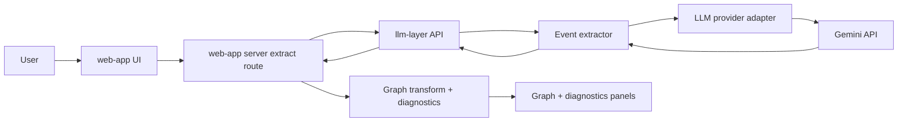
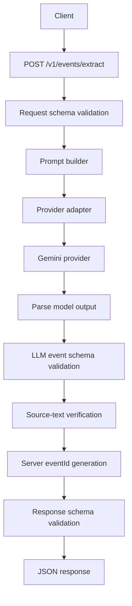
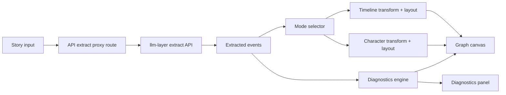

# Narrative Checker

Narrative Checker is a two-repository system for extracting structured narrative events from free-form stories and visualizing the result as interactive graphs with diagnostics.

At a high level:
- `llm-layer` is the backend extraction platform (Fastify + shared contracts + extractor + AWS Lambda deployment path).
- `web-app` is the Next.js client application (story input, extraction proxying, graph rendering, and diagnostics UI).
- This root repository coordinates both as Git submodules and provides a unified developer entry point.

## Repository Structure

```text
narrative-checker/
  llm-layer/   # Git submodule: extraction backend monorepo
  web-app/     # Git submodule: Next.js frontend
  package.json # Root scripts to run both projects
  .gitmodules  # Submodule source definitions
```

Submodule remotes:
- `llm-layer` -> `storylens-llm-layer`
- `web-app` -> `storylens-webapp`

## System Architecture

The system follows a contract-first, service-boundary architecture:

1. User submits a story in `web-app`.
2. Web app validates and forwards the request to `llm-layer` via server-side route.
3. `llm-layer` prompts an LLM provider (Gemini by default) through an adapter interface.
4. LLM output is parsed and strictly validated against shared schemas.
5. Validated events are returned to `web-app`.
6. Web app transforms events into graph models (timeline or character mode), runs diagnostics, and renders the result.

### End-to-End Flow



## `llm-layer` Architecture (Backend)

`llm-layer` is a pnpm monorepo with three main responsibilities:
- API surface and runtime concerns
- extraction orchestration
- shared contracts

### Internal Packages

- `apps/api`
  - Fastify HTTP API
  - input/output schema validation
  - auth, rate limits, body-size guardrails
  - health endpoints
  - centralized error mapping
  - Lambda entrypoint for container runtime
- `packages/contracts`
  - canonical Zod schemas and exported TypeScript types
  - action taxonomy, request/response envelopes, error contract
- `packages/llm-extractor`
  - prompt construction
  - provider abstraction + adapter call
  - JSON parsing, validation, retries, semantic checks
  - server-side `eventId` generation

### Backend Request Lifecycle



### Backend Contract Model

- Extract endpoint: `POST /v1/events/extract`
- Request:
  - `story` (required string)
  - `metadata.storyId` (optional)
- Event output includes:
  - `eventId` (server-generated UUID)
  - `action` (strict enum)
  - `actors` (non-empty)
  - optional targets/location/time
  - `sourceText` evidence
  - `confidence` in `[0,1]`
- Response envelope includes:
  - `events[]`
  - model metadata + optional token usage
  - `requestId` correlation id
  - typed error envelope on failures

### Reliability and Safety Patterns

- strict schema boundaries on request, model output, and response
- typed extraction failures with deterministic retry policy
- source evidence verification to reduce hallucinated grounding
- model-independent provider interface for extensibility
- consistent error codes and request IDs for observability

### Backend Deployment Architecture (AWS)

`llm-layer` is designed to deploy as a Lambda container behind API Gateway:

- image build -> ECR
- Lambda (`package_type = Image`) with alias-based rollout
- API Gateway HTTP API ingress
- SSM Parameter Store for runtime secrets
- CloudWatch logs + alarms
- Terraform bootstrap + runtime stacks for stateful IaC

Rollback is alias-based (fast retarget to prior Lambda version) without rebuilding images.

## `web-app` Architecture (Frontend)

`web-app` is a Next.js app with:
- landing page at `/`
- interactive checker at `/app`

Core responsibilities:
- collect story input
- invoke extraction through server-side proxy route
- support optional pronoun-resolution flows
- transform events into graph data
- render timeline/character graph modes
- show diagnostics and observability metadata in UI

### Frontend Data Path



### Graph + Diagnostics Model

- Graph modes:
  - timeline mode (event sequencing and temporal ordering)
  - character mode (co-occurrence and action-labeled relations)
- Deterministic IDs and transform behavior support repeatable rendering.
- Diagnostics classify structural narrative issues (error/warning), deduplicate findings, and project highlights onto nodes/edges.
- UI remains fail-open: graph can still render even when diagnostics are empty or filtered.

### Pronoun Resolver Integration

The web app includes a deterministic pronoun resolver with environment-gated behavior:
- debug preview path in client UI
- optional extraction-time substitution path through server route
- log-only path when substitution is disabled
- strict privacy approach in telemetry (no raw story text in resolver logs)

## Runtime Boundaries and Trust Model

- Browser never calls LLM provider directly.
- Web app server route acts as boundary for:
  - auth and secret isolation
  - request shaping and cancellation
  - upstream error normalization
- `llm-layer` is authoritative for extraction contract and event validity.
- `web-app` is authoritative for presentation transforms and diagnostics UX.

## Local Development

From repository root:

```bash
pnpm run llm-layer:dev
pnpm run web-app:dev
```

Other root scripts:

```bash
pnpm run llm-layer:typecheck
pnpm run llm-layer:test
```

Prerequisites:
- Node.js + pnpm
- initialized submodules (`llm-layer`, `web-app`)
- required environment variables in each submodule (for example, LLM provider keys and base URLs)

## Deployment Overview

- Frontend (`web-app`): standard Next.js deployment target (platform-specific).
- Backend (`llm-layer`): containerized Lambda deployment using Terraform and documented runbooks.
- Infrastructure as Code is split into:
  - backend bootstrap state infra
  - runtime service infra

## Key Design Decisions

- Contract-first integration between frontend and backend.
- Strict schema enforcement for nondeterministic LLM output.
- Server-generated IDs and explicit error envelopes for trust and observability.
- Provider abstraction to avoid vendor lock-in.
- Deterministic graph transforms and diagnostics to keep visualization stable.

## Architecture References

For subsystem-level detail, see:
- `llm-layer/Architecture.md`
- `web-app/Architecture.md`
